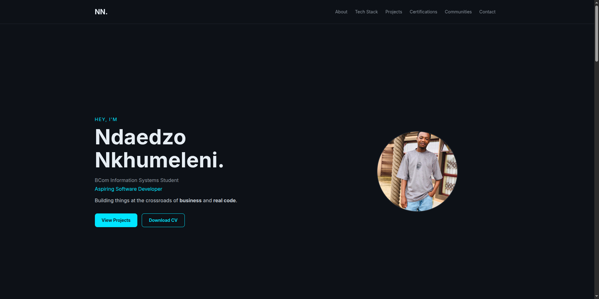

# Personal Portfolio Website

A responsive portfolio website built to showcase my skills, certifications, and development journey as a BCom Information Systems student and aspiring software developer.

---

## 🚀 Live Demo
View the website here:  
https://ndae777.github.io/ndaedzo-portfolio/

## 📸 Preview

---

## 🛠️ Tech Stack

- HTML
- CSS
- JavaScript
- Bootstrap
- AI to help structure and Debug

---

## 📌 Features

- Responsive design (mobile + desktop)
- Smooth navigation between sections
- Projects showcase with links to GitHub and demos
- Downloadable CV
- Contact section with direct links

---

## 🎯 Purpose

This portfolio was created to present my skills, learning progress, and projects in a clean and accessible format for internship and entry-level opportunities.

---

## 📁 Project Structure

- `index.html` – Main structure of the website  
- `styles.css` – Custom styling  
- `script.js` – Interactivity and UI behavior  
- `assets/` – Images and CV  

---

## ⚙️ Setup

1. Clone the repository  
2. Open `index.html` in your browser  

No installation required.

---

## 📌 Notes

This project is continuously being improved as I grow my skills in software development.

---

## 👤 Author

Ndaedzo Nkhumeleni  
BCom Information Systems Student  
